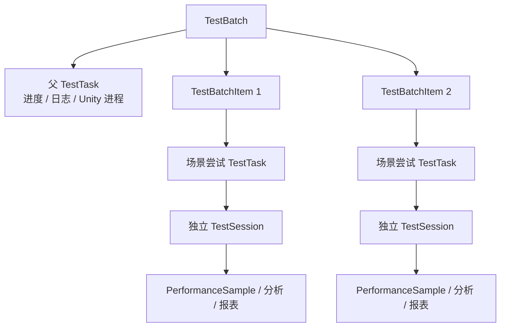

# 多场景连续测试编排实施方案

> 依据：`docs/problems/multi-scene-orchestration-plan.md`  
> 目标：在不破坏现有单场景测试、冷/热启动、实时进度、结果上传、分析和报表能力的前提下，实现同一 Unity Editor 内的多场景连续测试。  
> 文档用途：供 Cursor 按阶段实施。  
> 编写日期：2026-06-12

---

## 1. 实施结论

该需求可以实施，但不应直接把 `scene_resource_id` 改成数组，也不应让多个场景共用一个
`TestSession`。多场景编排需要独立的运行时父级状态机，同时继续复用现有单场景数据链路。

推荐采用：

```text
1 个 TestBatch
  └─ 1 个父 TestTask：编排进度、日志、Unity 进程与控制通道
      └─ N 个 TestBatchItem：场景顺序、状态、尝试记录、per-scene 配置
          └─ 每次尝试 1 个现有 TestTask + 1 个现有 TestSession
              └─ 现有 PerformanceSample / 分析 / 报表
```

Unity 首版使用一个版本化编排任务文件，一次启动或投递到同一个 Editor，按顺序执行：

```text
打开场景 → 进入 Play Mode → 采集 → 上传 → 退出 Play Mode
→ 打开下一场景 → ...
```

核心原则：

1. 现有单场景 API、任务 JSON 和 Unity 执行路径保持不变。
2. 多场景使用新的 API、服务和版本化 Unity 协议，不在旧请求中增加隐式行为。
3. 每个场景的每次尝试使用独立 Session，禁止重试时复用已有样本的 Session。
4. 父任务统一承载进度 WebSocket、日志、进程 PID 和停止操作，避免为每个场景建立连接。
5. 同一 Unity 工程首版只允许一个活动测试租约，防止单场景与多场景互相覆盖任务文件。
6. 场景失败后退出 Play Mode 并暂停，等待用户明确选择重试、跳过或终止。
7. 编排运行状态必须持久化，页面刷新和后端重启后可以恢复；本期不保存可复用的编排模板。
8. 冷启动最后退出继续使用现有退出看门狗，热启动完成后保持用户 Editor 打开。

---

## 2. 当前能力与复用边界

### 2.1 可直接复用

| 现有能力 | 多场景中的复用方式 |
| --- | --- |
| `TestScopeService` | 为每个场景规范化并保存一份 `test_scope` 快照 |
| `MetricScopeSelector` | 在当前编辑中的场景配置 Drawer 内复用 |
| `_ensure_scene_asset` | 为每个编排场景注册或复用 `SceneAsset` |
| `_build_session_config` | 抽取为可复用的单场景配置构建方法 |
| `_write_task_config` 的字段映射 | 抽取为 Unity 单场景运行配置构建器 |
| `XRTestManager` 两阶段采集 | 每次场景运行仍执行一次现有采集流程 |
| `TestDataUploader` | 每次上传到该场景 Session 的现有 batch upload 地址 |
| 进度 WebSocket | 扩展现有 payload，由父任务统一广播 |
| `SessionResultPanel` | 多场景结果 Tab 内按 Session 懒加载复用 |
| 单场景分析与报表 | 每个场景 Session 独立使用 |
| 冷启动退出看门狗 | 仅在整个批次结束后监控并回收冷启动 Editor |

### 2.2 不应直接复用或扩写的部分

- 不要让现有 `POST /unity-runner/test-tasks/start` 接受 `scenes[]`。
- 不要让现有单场景 `XRBatchTaskConfig` 同时承担多场景根配置。
- 不要将父批次状态塞入某个场景 Session。
- 不要用 `TestSession.config["batch_id"]` 扫描全部 Session 来代替规范的批次关联表。
- 不要在前端同时挂载多个 `MetricScopeSelector` 或多个 `SessionResultPanel`。
- 不要扩展 `pending-task.json` 为多个相互覆盖的文件；一个批次只投递一个编排配置路径。

---

## 3. 领域模型

### 3.1 推荐新增实体

建议通过 Alembic 新增：

- `backend/app/models/test_batch.py`
- `backend/app/models/test_batch_item.py`
- `backend/app/models/unity_project_lease.py`

#### `TestBatch`

用于表示一次实际提交并运行的多场景编排，不是可复用模板。

建议字段：

| 字段 | 类型 | 用途 |
| --- | --- | --- |
| `id` | Integer PK | 批次 ID |
| `project_id` | FK | 平台项目 |
| `creator_id` | FK | 创建用户 |
| `parent_task_id` | FK, unique | 父编排任务 |
| `status` | String, indexed | 批次状态 |
| `current_scene_index` | Integer | 当前顺序，建议 0-based 存储 |
| `scene_total` | Integer | 场景总数 |
| `unity_project_path` | String | 规范化后的工程路径 |
| `unity_project_key` | String, indexed | 工程路径哈希，用于并发租约 |
| `config` | JSON | 引擎、batchmode、ensure_plugin、协议版本 |
| `result_summary` | JSON | 完成/失败/跳过计数和最新错误 |
| `decision_version` | Integer | 用户决策乐观锁版本 |
| `started_at` / `completed_at` | DateTime | 生命周期 |
| `created_at` / `updated_at` | DateTime | 审计时间 |

推荐批次状态：

```text
pending
running
awaiting_user_decision
completed
partial_completed
failed
cancelled
```

`partial_completed` 表示至少一个场景完成，同时至少一个场景被跳过或最终失败。

#### `TestBatchItem`

用于表示编排中的一个逻辑场景位置。

建议字段：

| 字段 | 类型 | 用途 |
| --- | --- | --- |
| `id` | Integer PK | 编排项 ID |
| `batch_id` | FK, indexed | 所属批次 |
| `scene_index` | Integer | 编排顺序 |
| `scene_resource_id` | String | 启动资源 ID 快照 |
| `scene_id` | FK | `SceneAsset` |
| `scene_display_name` | String | 页面与日志主标签 |
| `unity_scene_path` | String | Unity 场景路径快照 |
| `status` | String, indexed | 场景项状态 |
| `attempt_count` | Integer | 已创建尝试次数 |
| `current_task_id` | FK nullable | 当前/最终场景任务 |
| `current_session_id` | FK nullable | 当前/最终场景 Session |
| `config` | JSON | per-scene 配置快照 |
| `attempt_history` | JSON | 历次 task/session/status/error 摘要 |
| `error_message` | Text nullable | 当前失败原因 |
| `started_at` / `completed_at` | DateTime | 生命周期 |

推荐场景项状态：

```text
pending
running
uploading
completed
failed
awaiting_user_decision
skipped
cancelled
```

增加唯一约束：

```text
UNIQUE(batch_id, scene_index)
```

#### `UnityProjectLease`

用于统一阻止同一 Unity 工程上的单场景与多场景并发运行。

建议字段：

| 字段 | 类型 | 用途 |
| --- | --- | --- |
| `project_key` | String PK | 规范化工程路径的 SHA-256 |
| `project_path` | String | 诊断使用的规范化路径 |
| `owner_type` | String | `single_scene` / `multi_scene` |
| `owner_id` | Integer | 单场景 task ID 或 batch ID |
| `parent_task_id` | FK nullable | 统一监控任务 |
| `heartbeat_at` | DateTime | 最近活动时间 |
| `expires_at` | DateTime | 租约过期时间 |
| `created_at` / `updated_at` | DateTime | 审计时间 |

### 3.2 继续使用现有 `TestTask` 与 `TestSession`

#### 父任务

父任务使用：

```text
task_type = "unity_multi_scene_orchestration"
scene_id = null
```

父任务负责：

- Unity 进程 PID；
- 冷启动/热启动模式；
- 编排配置文件、Unity 日志和 Runner 日志路径；
- 整批进度与最新事件；
- 停止整批；
- 后端进程监控和退出看门狗。

#### 场景任务

每个场景尝试继续创建一个现有 `TestTask`：

```text
task_type = "unity_multi_scene_item"
scene_id = 当前 SceneAsset.id
```

配置中写入：

```json
{
  "run_mode": "multi_scene",
  "batch_id": 18,
  "batch_item_id": 52,
  "parent_task_id": 240,
  "scene_index": 1,
  "scene_total": 3,
  "attempt": 1
}
```

#### 场景 Session

每个尝试使用独立 Session，继续使用现有样本归属、分析和报表。

Session 配置中额外写入同样的关联字段以及：

```json
{
  "scene_resource_id": "system-settings-scene-...",
  "scene_display_name": "Battle",
  "unity_scene_path": "Assets/Scenes/Battle.unity",
  "test_scope": {},
  "execution_plan": {},
  "scoring_definition": {}
}
```

Session `name` 继续使用现有项目递增 `#N`。前端主标签使用 `scene_display_name`。

### 3.3 为什么重试必须创建新 Session

失败后重试当前场景时，不应清空并复用原 Session，原因包括：

- 失败前可能已上传部分样本；
- 重复上传可能产生重复统计；
- 已完成或失败结果应保持可审计；
- 清空数据存在误删和并发风险。

重试流程应创建新的场景任务和 Session，并将旧尝试追加到 `attempt_history`。结果页默认展示最终成功尝试；若最终仍失败，则展示最后一次失败尝试，并允许查看历史尝试摘要。

### 3.4 状态关系图



---

## 4. 数据库与兼容策略

### 4.1 数据库迁移

使用项目已有 Alembic，新增 `test_batches`、`test_batch_items` 与 `unity_project_leases` 表。

不建议首版只使用 JSON 配置实现，原因是：

- 批次状态、当前场景和失败决策需要频繁查询；
- 页面刷新需要可靠恢复；
- JSON 扫描不利于并发校验和历史列表；
- 后续批次筛选、分组和统计会变得困难。

现有 `test_tasks`、`test_sessions`、`performance_samples` 不增加必需列，降低迁移风险。批次关联字段同时写入 Session/Task `config`，供旧接口与诊断日志读取。

### 4.2 旧数据兼容

- 没有 `run_mode` 的现有任务和 Session 统一视为 `single_scene`。
- 现有单场景列表、详情、分析和报表响应字段保持不变。
- 新增字段只能是可选字段，旧前端忽略后仍可工作。
- 批次相关 API 使用新路由，不改变现有单场景 API 行为。
- Alembic downgrade 只删除新增表，不修改旧数据。

### 4.3 Session 状态兼容

首版不建议向 `TestSessionStatus` 增加 `skipped`：

- 跳过是编排项状态，不一定存在可展示的数据 Session；
- 失败后用户选择跳过时，失败尝试的 Session 应继续保留为 `failed`；
- 尚未开始而被整批终止的预创建 Session 可标记为 `cancelled`。

页面使用 `TestBatchItem.status` 展示“已跳过”，不依赖 Session 状态表达编排语义。

---

## 5. 后端服务设计

### 5.1 新增服务

建议新增：

- `backend/app/services/unity_batch_service.py`
- `backend/app/services/unity_project_lease_service.py`

`UnityBatchService` 负责：

- 请求校验和规范化；
- 创建批次、父任务、场景项和首轮场景任务/Session；
- 构建编排配置文件；
- 启动或投递 Unity；
- 处理用户决策；
- 更新状态和结果摘要；
- 页面刷新后的批次恢复；
- 批次停止和异常对账。

`UnityRunnerService` 继续负责单场景，并抽取以下公共辅助方法供两个服务复用：

- Unity 引擎与场景资源解析；
- 场景文件、插件 manifest 校验；
- `test_scope` 规范化和 execution plan；
- SceneAsset 注册；
- 单次场景 Task/Session 配置构建；
- Unity 进程启动、监控、终止和退出看门狗；
- Runner 日志写入与 Unity 日志过滤。

不要让 `UnityBatchService` 复制一整份 `UnityRunnerService.start_test()`。

### 5.2 启动事务

建议启动批次按以下顺序：

1. 校验用户权限和项目存在。
2. 解析引擎和全部场景资源。
3. 规范化所有路径并校验同一 Unity 工程。
4. 校验场景数量、配置范围、总预计时长和 scope。
5. 获取 Unity 工程运行租约。
6. 在一个数据库事务中创建：
   - `TestBatch`
   - 父 `TestTask`
   - N 个 `TestBatchItem`
   - 每项首轮 `TestTask + TestSession`
7. 写入版本化编排 JSON。
8. 启动新 Editor，或向已打开 Editor 投递一次编排任务。
9. 保存父任务 PID、日志路径和 launch mode。
10. 提交后返回完整批次响应。

若第 7 或第 8 步失败：

- 批次和父任务标记 `failed`；
- 未开始的场景项标记 `cancelled`；
- 已创建 Session 标记 `cancelled`；
- 释放工程租约；
- 返回明确错误。

### 5.3 场景资源校验

所有场景必须由后端根据 `scene_resource_id` 重新解析，禁止信任前端提交的路径。

必须校验：

- 多场景模式至少 2 个场景。
- 建议首版最多 20 个场景。
- 场景资源 `enabled = true` 且文件存在。
- 所有场景的规范化 `project_path` 完全一致。
- 所有场景路径位于该项目的 `Assets/` 下。
- 首版建议拒绝重复 `scene_resource_id`，避免用户误添加；后续若有重复跑同场景需求再显式支持。
- 每场景至少选择 1 个叶子指标。
- `collect_interval`、两个 duration 沿用现有 Pydantic 范围。
- 建议整批预计运行时间上限为 4 小时，超出时拒绝并提示拆分。
- `batchmode`、`ensure_plugin` 只接收编排级值。

### 5.4 Unity 工程运行租约

仅检查 `Temp/UnityLockfile` 不足以防止任务覆盖。必须保证同一工程不会同时运行：

- 两个多场景批次；
- 多场景批次与单场景测试；
- 两个热启动单场景投递。

建议实现统一 `UnityProjectLeaseService`，由单场景和多场景启动共同使用。

租约建议包含：

```json
{
  "project_key": "sha256(normalized_project_path)",
  "owner_type": "single_scene | multi_scene",
  "owner_id": 18,
  "parent_task_id": 240,
  "acquired_at": "...",
  "heartbeat_at": "...",
  "expires_at": "..."
}
```

实现要求：

- 数据库中保存活动租约，`project_key` 唯一。
- 获取租约在事务中完成，冲突返回 `409 Conflict`。
- 父任务进度和状态变更时更新 heartbeat。
- 完成、失败、终止和启动失败时释放租约。
- 后端启动时或对账任务中可清理过期租约。
- 不能仅使用内存锁，因为多 worker 或后端重启会失效。

### 5.5 批次对账与超时

现有 `_sync_stale_task` 使用单场景时长估算，不能直接用于父任务。

批次预计时长建议为：

```text
sum(frame_rate_duration + metrics_duration + scene_transition_allowance)
+ upload_allowance_per_scene
+ user_decision_wait（不计入自动失败超时）
```

建议：

- 场景切换预留 30 秒；
- 每场景上传预留 60 秒；
- `awaiting_user_decision` 状态不因普通运行超时自动失败；
- 可设置较长的决策租约过期策略，例如 24 小时后仅告警，不自动继续；
- 父进程消失时，将当前运行项标记失败、批次标记 `failed`，保留已完成 Session。

批次结果摘要示例：

```json
{
  "scene_total": 5,
  "completed_count": 3,
  "failed_count": 1,
  "skipped_count": 1,
  "cancelled_count": 0,
  "current_scene_index": 4,
  "latest_error": "Battle 场景上传失败"
}
```

### 5.6 权威状态来源

实时进度用于展示，不应成为“场景已完成”的唯一依据。

推荐状态来源优先级：

1. `data_collection.py` 成功完成某个 Session 的 batch upload 后，若 Session 配置含
   `batch_item_id`，在同一事务内或事务提交后调用批次同步服务，将该 item 标记 completed。
2. Unity 上报的 `scene_failed` / `awaiting_user_decision` 事件用于记录无法通过上传接口表达的失败。
3. 批次对账任务根据 Session、场景 Task、父进程和最新心跳修复遗漏状态。
4. WebSocket progress 仅作为实时展示和心跳，不单独决定最终完成状态。

冷启动父进程监控不能直接复用“等待一个 Session completed”的现有逻辑。多场景父进程退出看门狗
应等待 `TestBatch` 进入终态后才开始正常退出宽限计时。

---

## 6. API 设计

### 6.1 启动批次

新增：

```text
POST /api/v1/unity-runner/test-batches/start
```

请求示例：

```json
{
  "project_id": 2,
  "unity_engine_id": "system-settings-engine",
  "batchmode": false,
  "ensure_plugin": true,
  "scenes": [
    {
      "scene_resource_id": "scene-lobby",
      "test_scope": {},
      "collect_interval": 1.0,
      "frame_rate_duration_seconds": 30,
      "metrics_duration_seconds": 30
    },
    {
      "scene_resource_id": "scene-battle",
      "test_scope": {},
      "collect_interval": 0.5,
      "frame_rate_duration_seconds": 45,
      "metrics_duration_seconds": 60
    }
  ]
}
```

响应应返回：

- `batch`
- `parent_task`
- `items`
- `process_id`
- `launch_mode`
- `orchestration_config_path`
- `unity_log_path`
- `runner_log_path`

### 6.2 查询批次

新增：

```text
GET /api/v1/unity-runner/test-batches/{batch_id}
GET /api/v1/unity-runner/test-batches?project_id=2&status=running
```

详情响应包含：

- 批次状态与摘要；
- 当前场景；
- 按顺序排列的 items；
- 每项当前 task/session 和 attempt history；
- 父任务最新进度；
- 可用操作 `allowed_actions`。

`allowed_actions` 由后端状态机计算，前端不要自行猜测。

### 6.3 用户决策

新增：

```text
POST /api/v1/unity-runner/test-batches/{batch_id}/decision
```

请求：

```json
{
  "action": "retry",
  "expected_item_id": 52,
  "expected_scene_index": 1,
  "decision_version": 3
}
```

允许动作：

```text
retry
skip
abort
```

服务端要求：

- 仅 `awaiting_user_decision` 可执行；
- 校验当前 item 和 scene index；
- 使用 `decision_version` 做乐观锁；
- 相同决策请求必须幂等；
- 重复或过期请求返回 `409` 和当前批次状态；
- 写审计日志，包含用户、动作、批次、场景和失败原因。

`retry` 时创建新的场景 Task/Session，并将完整新运行配置写入控制命令。

### 6.4 停止整批

新增：

```text
POST /api/v1/unity-runner/test-batches/{batch_id}/stop
```

行为：

- 父任务和批次标记 `cancelled`；
- 当前场景 Session/Task 标记 `cancelled`；
- 未开始 items 标记 `cancelled`；
- 冷启动向进程组发送停止；热启动写入 abort 控制命令；
- 释放工程租约；
- 已完成场景结果保留。

不要逐个调用现有单场景停止接口。

### 6.5 权限

沿用现有权限：

| 操作 | 权限 |
| --- | --- |
| 查看批次、日志、进度 | `Permission.TEST_VIEW` |
| 启动、决策、停止 | `Permission.TEST_EXECUTE` |

所有操作同时校验用户是否可访问所属项目，并写审计日志。

---

## 7. Unity 编排协议

### 7.1 保留单场景协议

现有 `XRBatchTaskConfig` 和 `RunFromConfigPath()` 的单场景行为保持不变。

多场景使用新的根配置类型，例如：

```csharp
XROrchestrationTaskConfig
XRSceneRunConfig
```

不要仅通过 `scenes != null` 在大量旧代码中分支。入口可以读取根 JSON 中的 `runMode` 或
`schemaVersion`，再分派到单场景执行器或多场景协调器。

### 7.2 编排 JSON

建议结构：

```json
{
  "schemaVersion": 1,
  "runMode": "multi_scene",
  "batchId": 18,
  "parentTaskId": 240,
  "projectId": 2,
  "unityProjectPath": "/path/to/project",
  "progressUrl": "http://localhost:8002/api/v1/unity-runner/progress/240",
  "deviceToken": "...",
  "quitOnComplete": true,
  "scenes": [
    {
      "batchItemId": 52,
      "sceneIndex": 0,
      "sceneTotal": 3,
      "attempt": 1,
      "taskId": 241,
      "platformSessionId": 180,
      "sessionName": "#180",
      "unityScenePath": "Assets/Scenes/Lobby.unity",
      "uploadUrl": ".../test-sessions/180/samples/batch",
      "collectInterval": 1.0,
      "frameRateDurationSeconds": 30,
      "metricsDurationSeconds": 30,
      "requestedMetricIds": [],
      "supportMetricIds": [],
      "qualityChecks": {},
      "qualityMetricChecks": {}
    }
  ]
}
```

安全要求：

- 配置文件写入后端 runtime 目录，权限尽量设为仅当前用户可读写。
- 不在前端响应或日志中返回 `deviceToken`。
- Unity 打开场景前继续执行现有路径归一化与 `Assets/` 边界检查。
- 配置使用 `schemaVersion`，未知版本立即失败并上报，不猜测执行。

### 7.3 Unity 状态机

建议新增 Editor 层协调器：

- `unity-xr-collector/Editor/XROrchestrationRunner.cs`

现有 `XRBatchTestRunner` 保持单场景入口，并抽取可复用的单场景生命周期方法。

推荐状态：

```text
Idle
PreparingScene
EnteringPlayMode
Collecting
Uploading
ExitingPlayMode
PreparingNextScene
AwaitingUserDecision
Completed
Aborted
```

正常场景切换：

1. 确认 Editor 不在 Play Mode、未编译、未更新资源。
2. 清理上一场景的 manager callbacks、上传宿主、实时上报和巡航。
3. 使用 `OpenSceneMode.Single` 打开下一场景。
4. 确认打开结果与期望路径一致。
5. 创建或复用场景内 `XRTestManager`，应用当前 `XRSceneRunConfig`。
6. 进入 Play Mode。
7. 等待现有稳定检测后开始采集。
8. 上传当前 Session。
9. 上传成功后退出 Play Mode。
10. Editor 稳定后继续下一场景；最后一个场景完成后才退出冷启动 Editor。

每次切场景必须重置：

- `XRTestManager` 的 Session、样本、计时器和 collectors；
- `UnityProgressReporter`；
- `TestDataUploader` coroutine host；
- `TestSceneFlythroughActivator`；
- 当前场景回调和 `SessionState` 中的 scene-run 状态。

不得在仍处于 Play Mode 或上传协程回调栈中直接调用 `OpenScene`。

### 7.4 域重载恢复

多场景比单场景经历更多 Play Mode 切换和域重载。编排状态不能只保存在静态字段中。

使用 `SessionState` 保存最小恢复状态：

```text
PendingOrchestrationConfigJson
ActiveBatchId
ActiveSceneIndex
ActiveBatchItemId
ActiveAttempt
OrchestrationState
PendingDecisionVersion
```

原则：

- 编排完整配置来源仍是后端写入的 JSON 文件；
- `SessionState` 只保存恢复游标和状态；
- `[InitializeOnLoadMethod]` 恢复时先去重所有 Editor 回调，再按状态恢复；
- 恢复后校验批次、场景 index 和配置版本；
- 不允许域重载后重复启动同一场景采集或重复上传。

### 7.5 失败暂停与控制命令

失败包括：

- 场景文件无法打开；
- 找不到 `XRTestManager`；
- 采集异常；
- 上传失败；
- 配置版本或路径校验失败。

失败时 Unity 应：

1. 停止当前采集和网络请求。
2. 退出 Play Mode。
3. 将失败事件上报父任务进度接口。
4. 进入 `AwaitingUserDecision`。
5. 在 Edit Mode 轮询控制命令文件。

建议控制文件：

```text
Library/XRDataCollector/orchestration-command-{batchId}.json
```

命令示例：

```json
{
  "schemaVersion": 1,
  "commandId": "uuid",
  "batchId": 18,
  "expectedBatchItemId": 52,
  "expectedSceneIndex": 1,
  "decisionVersion": 4,
  "action": "retry",
  "retrySceneConfig": {}
}
```

后端必须使用临时文件加原子重命名写入，Unity 处理成功后再删除。Unity 必须记录已处理
`commandId`，防止域重载后重复执行。

操作语义：

- `retry`：使用命令中的新 Session/Task 配置重新运行当前场景。
- `skip`：当前 item 标记 skipped，继续下一场景。
- `abort`：清理状态并结束整批。

### 7.6 热启动与冷启动

#### 冷启动

- 后端只启动一个 Unity Editor 进程。
- `quitOnComplete = true`。
- 整批最后结束后才调用 `EditorApplication.Exit()`。
- 继续使用现有后端退出看门狗。

#### 热启动

- `pending-task.json` 仍只作为一个任务邮箱。
- 邮箱内容只包含一个编排配置路径，不写入 N 个场景任务。
- `quitOnComplete = false`。
- 完成或终止后退出 Play Mode，但保持用户 Editor 打开。

---

## 8. 进度、日志与状态同步

### 8.1 单一父任务进度通道

多场景只订阅父 `task_id`：

```text
/unity-runner/progress/{parent_task_id}/ws
```

扩展 `UnityProgressUpdate`，新增可选字段：

```json
{
  "run_mode": "multi_scene",
  "batch_id": 18,
  "batch_status": "running",
  "batch_item_id": 52,
  "scene_index": 1,
  "scene_total": 3,
  "scene_resource_id": "scene-battle",
  "scene_display_name": "Battle",
  "scene_session_id": 180,
  "scene_task_id": 241,
  "attempt": 1,
  "scene_progress": 0.52,
  "overall_progress": 0.43,
  "allowed_actions": []
}
```

现有单场景 progress 字段保持不变。新字段均为可选，旧前端不会受影响。

### 8.2 总进度计算

总进度不要简单使用“当前场景序号 / 总数”，应按预计时长加权：

```text
completed_scene_weight
+ current_scene_weight × scene_progress
---------------------------------------
sum(all scene weights)
```

场景权重建议使用：

```text
frame_rate_duration + metrics_duration + 固定上传/切换预留
```

失败等待用户决策时，`overall_progress` 保持不变，状态显示“等待处理”，不能继续虚增。

### 8.3 日志

父任务使用一份 Runner 日志和一份 Unity 日志。所有多场景日志必须带前缀：

```text
[批次 18][场景 2/5 Battle][尝试 1] ...
```

场景子任务配置引用父任务日志路径，避免生成大量难以对应的日志文件。

日志接口可复用现有任务日志读取逻辑，并新增按 `batch_id` 获取父任务日志的便利接口。

### 8.4 状态写入

后端收到进度事件时：

- 更新父任务 `result_summary.latest_progress`；
- 更新批次 heartbeat、状态、当前 item；
- 更新场景 item 状态；
- 必要时同步场景 Task 状态；
- 仅在状态变化或现有节流条件满足时写 Runner 日志。

不要每秒提交整份 items 列表，避免数据库写放大。

---

## 9. 前端实施方案

### 9.1 保持单场景默认行为

`ProjectDetail.tsx` 默认继续展示现有单场景表单。增加模式切换：

```text
单场景测试 | 多场景测试
```

切换模式只切换配置区和运行监控区，不修改现有单场景请求、`activeRun` 和结果流程。

建议将现有单场景 UI 逐步抽取为组件，但避免在本期顺手重写整页：

- `SingleSceneTestPanel`
- `MultiSceneOrchestrationPanel`

### 9.2 编排编辑状态

新增前端类型：

```ts
interface SceneRunDraft {
  clientId: string
  sceneResourceId: string
  sceneName: string
  scenePath: string
  testScope: TestScope
  collectInterval: number
  frameRateDurationSeconds: number
  metricsDurationSeconds: number
}
```

新增场景时：

- 使用已加载的全局 `default_scope` 深拷贝；
- 使用单场景表单当前默认采集时长；
- 不共享对象引用，避免修改一个场景时影响其他场景。

提供：

- 添加场景；
- 删除场景；
- 上移/下移；
- 可选拖拽排序；
- 复制上一场景配置；
- 从全局默认恢复。

为了减少依赖和风险，首版优先使用 Ant Design 按钮上移/下移；若项目已经安装 `@dnd-kit`，再增加拖拽。不要仅为排序引入大型新库。

### 9.3 场景配置编辑性能

不要在列表中为每一项都渲染完整 `MetricScopeSelector`。

推荐：

- 列表只展示场景名、路径、指标数量和时长摘要；
- 点击“编辑配置”后打开一个 Drawer；
- Drawer 内只挂载当前场景的一个 `MetricScopeSelector`；
- 保存 Drawer 草稿后再更新该场景项。

这样场景数量增加时不会产生大量 Checkbox 和 Collapse 实例。

### 9.4 启动前校验

前端用于即时反馈，后端仍必须重复校验：

- 至少 2 个场景；
- 无重复场景；
- 每场景至少 1 个指标；
- 每个数值在允许范围；
- 所有场景 `project_path` 相同；
- 场景资源存在且 enabled；
- 编排级参数完整。

### 9.5 运行监控

新增独立 `activeBatch`，不要替换 `activeRun`：

```ts
interface ActiveUnityBatch {
  batchId: number
  parentTaskId: number
  status: string
  currentSceneIndex: number
  sceneTotal: number
  items: BatchItem[]
  allowedActions: string[]
}
```

运行中页面展示：

- 批次状态；
- 总进度；
- 当前场景 `2/5 Battle`；
- 当前场景阶段、实时指标和日志；
- 场景列表及每项状态；
- 终止整批按钮。

刷新页面后调用活动批次查询恢复 `activeBatch`，再重新连接父任务 WebSocket。

### 9.6 失败决策 UI

当批次进入 `awaiting_user_decision`：

- 页面通知明确显示失败场景和原因；
- 编排监控区固定显示等待处理状态；
- Modal 提供：
  - 重试当前场景
  - 跳过并继续
  - 终止整批

按钮是否可用完全根据后端 `allowed_actions`。

提交决策时禁用三个按钮，避免重复点击；若返回 `409`，刷新批次详情并展示最新状态。

### 9.7 多场景结果

多场景结果页使用场景 Tab：

```text
Lobby [完成] | Battle [失败后重试成功] | Cutscene [已跳过]
```

实现要求：

- Tab 标题使用 `scene_display_name`；
- 仅当前激活 Tab 挂载 `SessionResultPanel`；
- completed 项显示最终成功 Session；
- failed 项显示最后失败 Session 和错误；
- skipped 项显示跳过原因，不强行渲染空结果；
- attempt history 以次要区域展示。

### 9.8 历史列表

首版建议新增独立“多场景批次”列表或在项目详情历史区增加批次分组，而不是把父批次伪装成 Session。

Sessions 列表继续以 Session 为主，并增加可选标签：

- `单场景`
- `多场景 · Battle`

对于多场景 Session，可提供“查看所属批次”入口。项目详情的批次列表展示：

- 场景数；
- 完成/失败/跳过计数；
- 状态；
- 开始和结束时间；
- 进入批次详情。

---

## 10. 安全与可靠性设计

### 10.1 输入安全

- 所有资源路径必须由后端资源 ID 解析。
- 使用 `Path.resolve()` / 平台等价方式规范化后比较工程路径。
- Unity 端继续验证场景在项目 `Assets/` 目录内。
- 限制场景数量、单场景时长和总预计时长。
- 不允许前端指定上传 URL、进度 URL、任务 ID 或 Session ID。
- 不在日志和 API 响应中泄露设备令牌。

### 10.2 控制命令安全

- 决策 API 需要 `TEST_EXECUTE` 和项目访问权限。
- 使用 `decision_version`、`expected_item_id` 和 `commandId` 防止过期或重复命令。
- 控制文件使用临时文件加原子重命名。
- Unity 仅接受与当前批次、当前 item、当前 decision version 一致的命令。
- 处理后记录并删除命令，域重载后不能重复消费。

### 10.3 并发与幂等

- 同工程统一租约阻止并发运行。
- 批次启动请求可支持客户端 `idempotency_key`，避免网络重试创建两批任务。
- 决策接口必须幂等。
- Session 上传沿用当前接口，但重试使用新 Session，规避重复样本。
- 状态更新使用数据库事务和乐观锁版本。

### 10.4 故障恢复

| 故障 | 恢复策略 |
| --- | --- |
| 页面刷新 | 查询活动批次并重连父任务 WebSocket |
| WebSocket 断开 | 沿用 latest progress 轮询回退 |
| Unity 域重载 | `SessionState` 恢复编排游标 |
| 后端重启 | 从 TestBatch、父任务 PID、进度与租约恢复对账 |
| Unity 进程退出 | 当前项失败、批次失败、已完成结果保留 |
| 上传失败 | 退出 Play Mode，进入等待用户决策 |
| 决策重复提交 | `decision_version` 返回 409 或幂等成功 |
| 冷启动退出卡死 | 复用现有退出看门狗回收进程组 |

---

## 11. 建议实施阶段

### 阶段 0：冻结现有单场景回归基线

实施前记录并自动化验证：

- 单场景冷启动完成；
- 单场景热启动完成；
- 用户停止单场景；
- 实时 WebSocket 和轮询回退；
- scope 快照；
- 结果分析和报表；
- 冷启动退出看门狗。

后续每个阶段均运行这些回归。

### 阶段 1：后端批次模型与只读 API

1. 新增 Alembic migration。
2. 新增 `TestBatch`、`TestBatchItem` 模型和响应 schema。
3. 新增批次列表、详情 API。
4. 增加 `run_mode` 的兼容推断。
5. 增加批次状态机纯函数和测试。

完成标准：可以创建测试数据并正确查询批次，不接入 Unity。

### 阶段 2：统一工程租约与批次启动构建

1. 抽取 `UnityRunnerService` 公共单场景配置构建能力。
2. 实现 `UnityProjectLeaseService`。
3. 单场景启动接入租约，但保持 API 行为不变。
4. 实现批次启动校验、事务创建和编排 JSON 构建。
5. 暂不真正循环场景，可使用测试桩验证配置。

完成标准：同工程并发请求被可靠拒绝；批次配置和所有 Session 快照正确。

### 阶段 3：Unity 同 Editor 多场景状态机

1. 新增 `XROrchestrationRunner` 和版本化配置类型。
2. 抽取并复用单场景打开、应用配置、采集、上传和清理方法。
3. 实现正常的两场景连续运行。
4. 实现域重载恢复和最后退出行为。
5. 日志增加批次/场景/尝试前缀。

完成标准：至少两个场景在一个 Editor 中依次完成，并分别上传到独立 Session。

### 阶段 4：进度、停止和失败决策

1. 扩展父任务 progress payload。
2. 实现总进度和状态同步。
3. 实现命令文件协议。
4. 实现 retry/skip/abort API。
5. 实现重试新建 Session。
6. 实现批次停止和异常对账。

完成标准：场景失败后可靠暂停，三种用户决策均可完成且可恢复。

### 阶段 5：前端编排工作台与监控

1. 保留现有单场景默认 UI。
2. 新增多场景模式、编排列表和单 Drawer 配置编辑。
3. 新增 `activeBatch`、父任务 WebSocket 和刷新恢复。
4. 新增失败决策 Modal。
5. 新增批次结果 Tabs。

完成标准：用户可从页面完成配置、启动、监控、处理失败和查看各场景结果。

### 阶段 6：历史、报表与完整回归

1. 增加项目批次历史列表和 Session 运行类型标签。
2. 每场景独立报表入口。
3. 完成冷启动、热启动、失败和重启恢复回归。
4. 补充运维和故障诊断文档。

首版不实现批次聚合报告和编排模板。

---

## 12. 测试方案

### 12.1 后端单元与 API 测试

必须覆盖：

- 少于 2 个场景拒绝。
- 超过场景数量上限拒绝。
- 重复场景拒绝。
- 不同 `project_path` 拒绝。
- 场景文件不存在或 disabled 拒绝。
- 每场景无指标拒绝。
- 每场景 scope、execution plan 和时长快照正确。
- 父任务、items、场景任务和 Sessions 在事务中正确创建。
- 启动失败后状态回滚/失败标记和租约释放。
- 同工程单场景与多场景并发冲突返回 409。
- 不同工程可独立运行。
- 批次状态汇总正确。
- retry 创建新 Task/Session，不复用失败 Session。
- skip、abort 状态正确。
- 决策版本过期和重复提交正确处理。
- 页面刷新查询可恢复当前状态。
- 父进程退出后的对账正确。
- 旧单场景接口响应与行为不变。

### 12.2 Unity 编辑器测试

建议拆分可测试的纯逻辑：

- 配置版本解析；
- 场景游标推进；
- 状态转换；
- 命令校验与幂等；
- 总进度计算；
- 下一个场景选择；
- retry 配置替换。

真实 Editor 回归矩阵：

| 场景 | 预期 |
| --- | --- |
| 冷启动 2 场景全部成功 | 一个 Editor，两个独立 Session，最后退出 |
| 热启动 2 场景全部成功 | 一个已打开 Editor，完成后保持打开 |
| 第二场景打开失败 | 暂停并等待用户决策 |
| 第二场景上传失败后 retry | 新 Session 重试成功 |
| 失败后 skip | 跳过并继续下一场景 |
| 失败后 abort | 整批取消，已完成结果保留 |
| 运行中终止 | 当前和待执行项取消 |
| 场景间域重载 | 不重复采集和上传 |
| 最后退出卡住 | 后端看门狗回收，批次仍完成 |

### 12.3 前端测试

- 默认仍为单场景模式。
- 单/多场景切换不污染各自表单状态。
- 新增场景继承全局 default scope 的深拷贝。
- 删除、排序、复制配置正确。
- Drawer 只编辑目标场景。
- 启动前校验完整。
- 运行监控显示总进度和当前场景。
- WebSocket 断开后轮询恢复。
- 页面刷新后恢复 activeBatch。
- 失败 Modal 三种操作正确。
- 多场景结果只懒加载当前 Tab。
- 单场景结果 UI 无变化。

### 12.4 回归命令

```bash
cd backend
python -m pytest tests/ -q

cd ../frontend
npm run check
npm run build
```

Unity 端必须额外完成真实冷启动和热启动手工回归，普通 Python/前端测试不能替代。

---

## 13. 验收标准

- 默认单场景入口、启动请求和结果展示保持现状。
- 用户可进入多场景模式，添加、删除并调整至少两个同工程场景的顺序。
- 每场景可独立配置 scope、采集间隔和两个采集时长。
- 一个 Editor 可按顺序完成多个场景，且每个场景数据进入独立 Session。
- 页面显示批次总进度、当前场景、当前阶段、实时数据和带场景前缀的日志。
- 场景失败后停止推进，用户可重试、跳过或终止。
- 重试使用新 Session，不混入旧样本。
- 刷新页面后可以恢复活动批次。
- 同一 Unity 工程不能并行运行相互冲突的单场景或多场景任务。
- 冷启动批次结束后 Unity 正常退出或由退出看门狗回收。
- 热启动批次结束后用户 Editor 保持打开。
- 历史页面可区分单场景与多场景，并按场景 Tab 查看结果。
- 旧 Session、分析、报表和 API 保持兼容。
- 后端、前端自动测试通过，并完成真实 Unity 回归矩阵。

---

## 14. 主要文件改动清单

### 后端新增

```text
backend/app/models/test_batch.py
backend/app/models/test_batch_item.py
backend/app/models/unity_project_lease.py
backend/app/services/unity_batch_service.py
backend/app/services/unity_project_lease_service.py
backend/app/routers/unity_batches.py
backend/alembic/versions/<revision>_add_test_batches.py
backend/tests/test_unity_batches.py
backend/tests/test_unity_project_lease.py
```

### 后端修改

```text
backend/app/services/unity_runner_service.py
backend/app/routers/unity_runner.py
backend/app/routers/progress_ws.py
backend/app/routers/projects.py
backend/app/routers/data_collection.py
backend/app/main.py
```

### Unity 新增

```text
unity-xr-collector/Editor/XROrchestrationRunner.cs
unity-xr-collector/Editor/XROrchestrationRunner.cs.meta
unity-xr-collector/Editor/XROrchestrationConfig.cs
unity-xr-collector/Editor/XROrchestrationConfig.cs.meta
```

### Unity 修改

```text
unity-xr-collector/Editor/XRBatchTestRunner.cs
unity-xr-collector/Runtime/Core/XRTestManager.cs
unity-xr-collector/Runtime/Network/UnityProgressReporter.cs
unity-xr-collector/Runtime/Network/TestDataUploader.cs
```

### 前端新增

```text
frontend/src/components/MultiSceneOrchestrationPanel/
frontend/src/components/SceneRunConfigDrawer/
frontend/src/components/MultiSceneBatchMonitor/
frontend/src/components/MultiSceneBatchResults/
frontend/src/api/unityBatches.ts
```

### 前端修改

```text
frontend/src/pages/Projects/ProjectDetail.tsx
frontend/src/pages/Sessions/index.tsx
frontend/src/api/unityRunner.ts
```

---

## 15. 明确禁止的实现方式

Cursor 实施时应避免：

1. 直接将现有单场景 `scene_resource_id` 改为数组。
2. 多个场景共用同一个 Session 或同一个上传 URL。
3. 重试时删除旧样本并复用失败 Session。
4. 在 Play Mode 或上传回调栈中直接打开下一场景。
5. 只用前端状态保存编排，导致刷新后丢失。
6. 只使用进程内锁，忽略后端多 worker 和重启。
7. 为每个场景建立独立 WebSocket 和独立 Unity 进程。
8. 在列表中同时渲染所有场景的完整指标选择器和结果面板。
9. 让前端提交或覆盖 Unity 文件路径、上传地址和 Session ID。
10. 修改全局默认 scope 后影响已创建批次。
11. 将运行时批次错误实现成可复用模板 CRUD。
12. 为实现多场景顺手重写现有单场景页面和分析链路。

---

## 16. 二期扩展占位

首版稳定后再考虑：

- 设置页保存具名全局场景编排模板；
- 允许同一场景重复运行并设置重复次数；
- 多场景聚合对比与聚合 PDF；
- 批次 ZIP 导出；
- 场景间等待、预热和自定义钩子；
- 跨 Unity 工程编排；
- 多 Unity 进程并行调度；
- 定时/夜间自动回归；
- 基于批次历史的趋势对比。

这些能力应建立在本方案的批次、场景项、独立 Session、状态机和工程租约之上，不应在首版提前实现。
